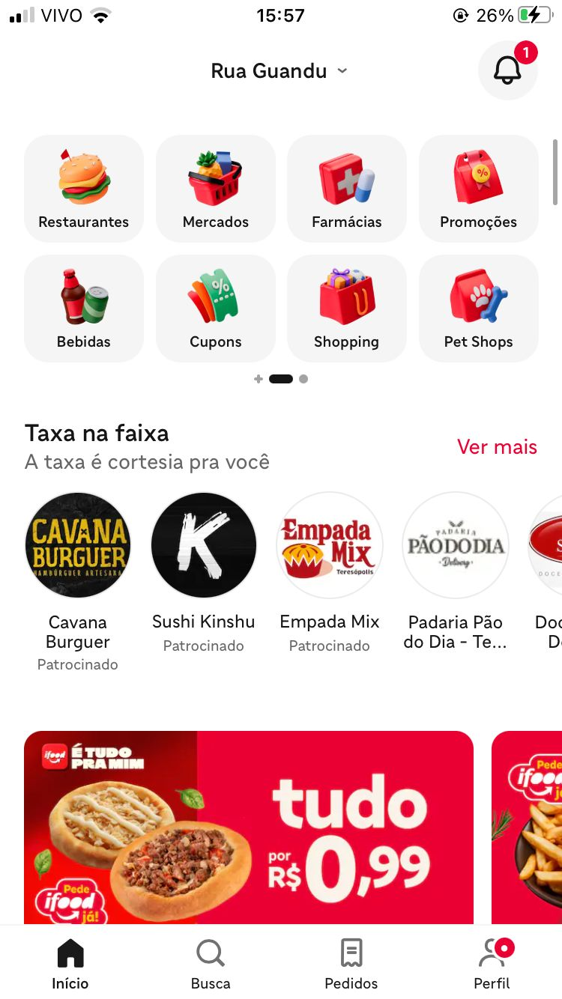
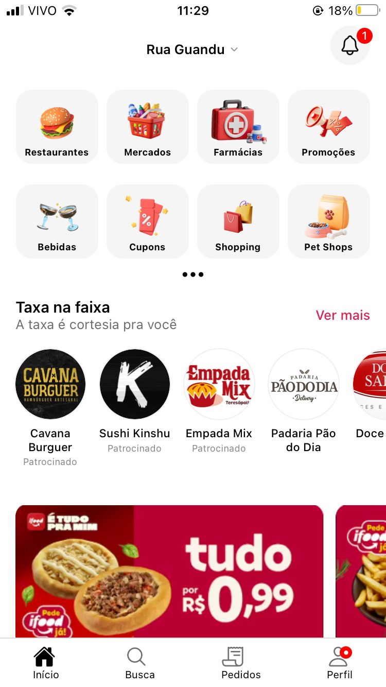
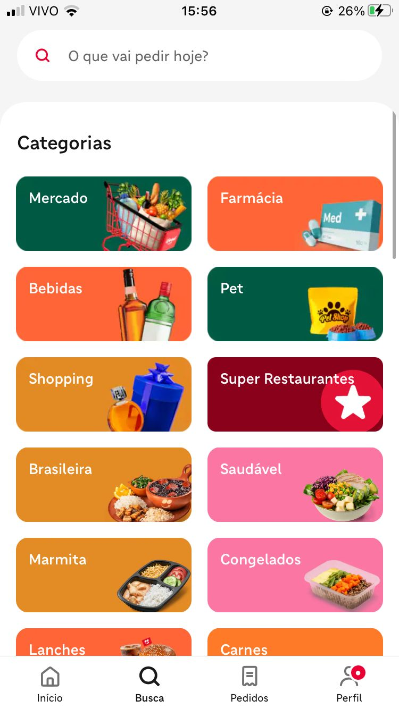
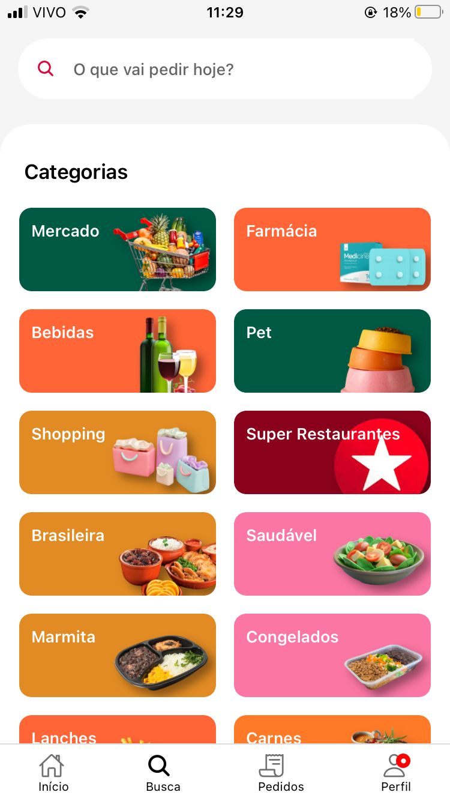

# 📱 Trabalho Individual - Desenvolvimento Mobile

Este projeto faz parte do trabalho individual da disciplina de Desenvolvimento Mobile do programa Serratec.  
O objetivo foi **reproduzir visualmente a interface de um aplicativo real**, praticando os conhecimentos adquiridos com **React Native**.

O aplicativo escolhido para clonagem foi o **iFood**, focando em reproduzir o layout da sua **tela inicial** e a **tela de busca**.

## 🎨 Comparação de Telas

### 🏠 Primeira Tela – Página Inicial
| Original | Clonada |
|--------------|-------------|
|  |  |
---

### 🔍 Segunda Tela – Página de Busca
| Original | Clonada |
|--------------|-------------|
|  |  |
